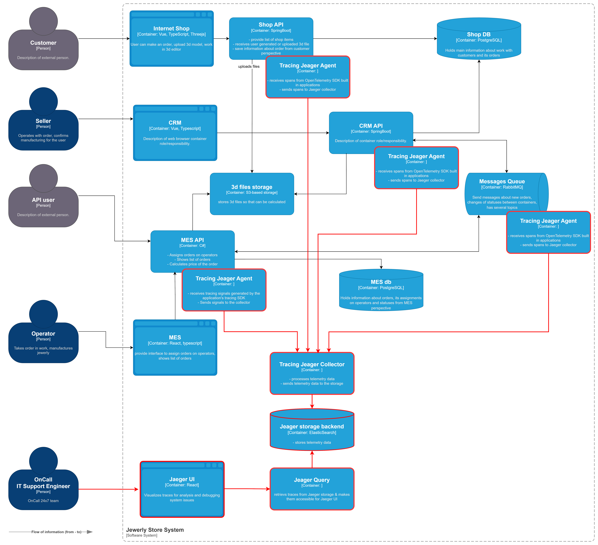
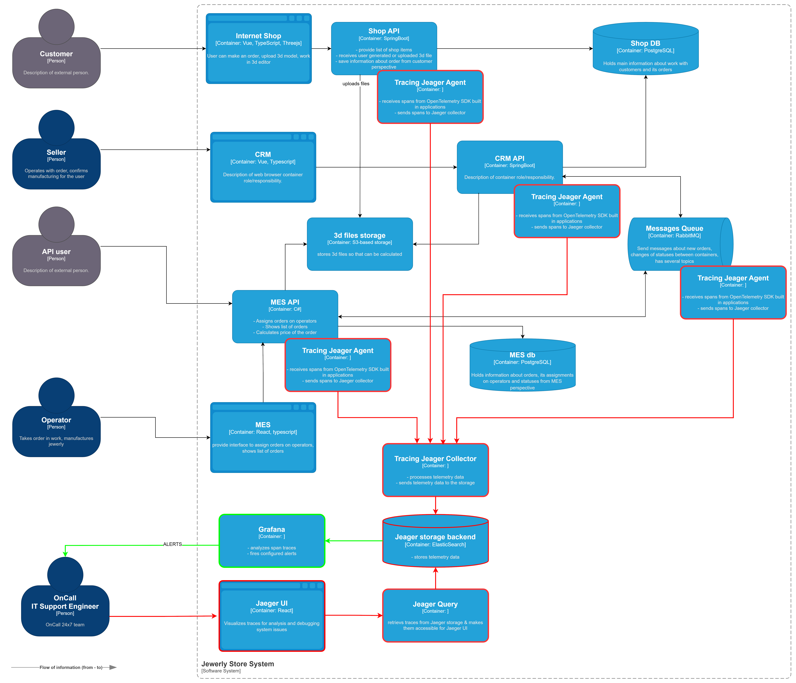

# Задание 3. Трейсинг
## Анализ системы компании и C4-диаграммы в контексте планирования трейсинга
### Места, где заказ может «сломаться» или зависнуть
* __Shop API__:
  * взаимодействие с фронтами при создании заказа пользователем
  * загружает 3D модели в хранилище S3 для расчета стоимости заказа в MES API
  * сохраняет информацию о заказе пользователя в Shop DB
* __CRM API__:
  * получает из Shop DB новые заказы пользователей, созданные через Shop API
  * отправляет в RabbitMQ информацию о новых заказах, созданные через Shop API, для обсчета в MES API
  * изменяет статусы заказов в Shop DB
  * получает из RabbitMQ информацию о новых заказах, созданных через MES API
  * получает из RabbitMQ информацию о стоимости заказов, рассчитанной MES API
  * отправляет в RabbitMQ информацию о подтвержденных заказах для запуска их в производство для MES API
* __RabbitMQ__:
  * пересылает сообщения о заказах и их статусах между CRM API и MES API
* __MES API__:
  * получает заказы от внешних продавцов-агрегаторов
  * передает информацию о новых заказах от внешних продавцов-агрегаторов в RabbitMQ для CRM API
  * загружает 3D модели из S3 хранилища для дальнейшего обсчета
  * рассчитывает стоимость заказов по загруженным 3D моделям из S3 хранилища
  * сохраняет информацию о заказе в работе у операторов в MES DB
  * отправляет в RabbitMQ информацию о заказах в работе у операторов

Соответственно в каждом из перечисленных выше шагов на пути заказа может произойти ошибка и заказ зависнет. 
Поэтому в каждом перечисленном шаге нужно добавить трассировку
### Список данных, которые должны попадать в трейсинг
#### Общее
* traceId - id трассировки цепочки подзапросов в рамках операции, используемый для склеивания дерева подзапросов при анализе
* spanId - id текущего подзапроса
* operationName - имя метода или его действия, соответствующего конкретному подзапросу (span)
* orderId - id заказа, для поиска по заказу
* orderStatus - статус заказа в рамках конкретного подзапроса (span). Может подсветить коллизии при одновременной обработке одного заказа разными процессами
* startTime - время начала подзапроса (span)
* durationTime - длительность выполнения подзапроса (span)
#### веб-сервис
* serviceName - название сервиса, выполняющего конкретный подзапрос (span)
* url - полный URL запроса
* clientPeerIP - IP-адрес клиента, инициировавшего текущую операцию. Может подсветить проблемы географической удаленности
* clientAuthInfo - контекст авторизации клиента, инициировавшего текущую операцию (имя или идентификатор сессии), при наличии
* responseLength - длина тела ответа вебсервиса 
* status - статус завершения подзапроса (span): OK/ERROR
* errorInfo - короткое описание ошибки
* errorStack - стэк вызовов возникшей ошибки
#### БД
* dbConnectionString - строка подключения к БД
* dbStatement - SQL выражение обращения к БД без конфиденциальных данных
* dbRowCount - число строк, которые вернул/обновил запрос к БД (если span соответствует взаимодействию с БД)
* dbSqlQueryDurationTime - время выполнения запроса к БД. Само обращение может быть коротким, а обработка его данных может занять продолжительное время по какой-то причине
#### rabbitMQ
* messagingOperationType - publish/subscribe/send/receive
* messagingQueue - название очереди
* messagingMessageId - ID сообщения из очереди
* messagingSize - размер отправленного/считанного сообщения
* messagingDurationTime - время выполнения действия с очередью/сообщением
* messagingErrorInfo - ошибка и её причины при обработке сообщений/работе с очередью
#### S3
* s3OperationType - тип действия put/get/delete/list
* s3BucketName - имя используемого bucket-а S3
* s3ObjectKey - ключ объекта в хранилище s3
* s3OperationStatus - статус HTTP операции от S3
* s3DurationTime - время выполнения действия с S3 хранилищец
* s3ObjectSize - размер загруженного/полученного объекта
## Мотивация
Трейсинг значительно повышает наблюдаемость (observibility) того, как заказ движется через все этапы и взаимодействия.
С технической т.зр. это:
* Дает возможность быстрее диагностировать источник проблем и выявить узкие места на пути заказа: задержки, ошибки, нехватка ресурсов
* Даёт детальную информацию для разбора инцидентов, связанных с внешними партнерами (точно время, набор идентификаторов и т.д.), упрощает сопровождение системы
* Даёт возможность настроить алёртинг на сложные кейсы, вроде "Зависание 10% заказов на обращении к Shop DB"
С т.зр. бизнеса это:
* даёт снижение жалоб B2C-клиентов за счёт проактивного или более быстрого устранения проблем, а также улучшает клиентский опыт за счет повышения производительности
* удерживает B2B-партнёров за счет стабильности предоставленного API и возможности аргументировано отвечать на их претензии
* оптимизирует траты на масштабирование IT, за счет большей осмысленности и возможности планирования, как и в случае с мониторингом
## Предлагаемое решение
Для реализации трассировки предлагается взять за основу решение Jaeger, встроив в код OTel SDK.
- **OTel SDK** — встраивается в код Shop API, CRM API, MES API. Для RabbitMQ также возьмем инструмент amqplib из OTelSDK. Формирует trace/span, передаёт их агенту, развернутому локально.
- **Jaeger Agent** — разворачивается локально рядом с каждым API-сервисом (Shop API, CRM API, MES API, RabbitMQ). Получает сигналы от OTel SDK и отправляет их в Collector.
- **Jaeger Collector** — агрегирует данные от агентов и передаёт в хранилище.
- **Jaeger Storage Backend** (ElasticSearch) — база для долгосрочного хранения trace-данных. Выберем рекомендуемый ElasticSearch
- **Jaeger UI + Jaeger Query** — интерфейс для просмотра и анализа трассировок спланков, получаемый через промежуточный сервис Query, который ходит в базу данных и отдает уже собранные трейсы.

[C4 схема контейнеров системы + tracing](jewerly_c4_model_tracing.jpg)

Для автоматического мониторинга процесса прохождения заказа можно:
* развернуть инстанс Grafana 
* подключить в Grafana в качестве источника данных ElsaticSearch, используемый Jaeger Collector-ами
* настроить алёрты на ситуации "зависания" заказов:
  * заказ завис на одном спане и не движется дальше в течение 10 мин.
  * продолжительность определённых спанов превышает пороговые значения. Например, обновление статуса заказа > 1 мин.
  * родительский спан (root span) по заказу длится более 1 дня
  * спустя 1 час нет дочернего спана с orderStatus = "MANUFACTURING_STARTED"

[C4 схема контейнеров системы + tracing + order_monitoring](jewerly_c4_model_tracing_ordermon.jpg)

## Компромиссы
* при высоком RPS трассировок спанов будет писаться очень много, что весьма дорого в обслуживании. В качестве компромисса можно:
  * отказать от телеметрии из RabbitMQ, т.к. обращений к ней зафиксированы со стороны API, а само решение является проприетарным и можно считать надежным
  * настроить sampling, используя техники предоставляемые Open Telemetry: ParentBasedSampler TraceIdRatioBasedSampler
* MES API - купленная система, которая может быть еще не полностью понятна команде. Будет сложно покрыть на 100% все пути работы с заказом, потом в качестве компромисса:
  * обернуть для подключения OTel SDK очевидные код и начать использовать трасировку как есть
  * находить не покрытый код при анализе новых проблем и дорабатывать его в следующих итерациях
## Аспекты безопасности
* __Идентификация пользователей__
  * Каждый сотрудник, имеющий доступ к системе, должен пройти процедуру идентификации через корпоративную инфраструктуру (например, LDAP или Active Directory).
  * Доступ предоставляется только ограниченному кругу сотрудников, имеющим соответствующую роль («Поддержка», «Администратор» и др.).
  * Использование двухфакторной аутентификации (2FA) путем требования ввода одноразового пароля после успешного входа в систему
* __Мониторинг активности__
  * Журналирование всех действий пользователей в системе с указанием дат, времен и IP адресов
  * Автоматическое оповещение администраторов о подозрительных действиях (необычные входы, попытки изменения конфигурации и другие аномалии)
* __Шифрование и фильтрация данных__
  * Шифрование трафика между компонентами Jaeger с использованием TLS/SSL сертификатов
  * Шифрование трафика между UI и пользователем: через HTTPS
  * Запрет на сохранение персональные данных без частичного или полного маскирования на уровне SDK/Агентов, чтобы данные не попадали в сеть
* __Ограничение внешнего доступа__
  * Доступ к инфраструктуре Jaeger разрешен только внутренним пользователям сети компании
  * Для удаленного доступа обязательно использование VPN с многоуровневой аутентификацией
* __Уязвимость хранимых данных__
  * Ограничить срок хранения трассировок спанов разумными сроками (например, 30 дней) с последующим удалением
  * Реализовать возможность удалять все трассировки по отношению к одному или группе клиентов (чувствительные клиенты, запросы за забвение)
* __ Регулярные обновления и патчи__
  * Постоянное обновление программного обеспечения платформы Jaeger и связанных компонентов инфраструктуры для устранения уязвимостей.
* __Обучение сотрудников__
  * Проведение регулярных тренингов по вопросам информационной безопасности среди сотрудников, имеющих доступ к платформе.