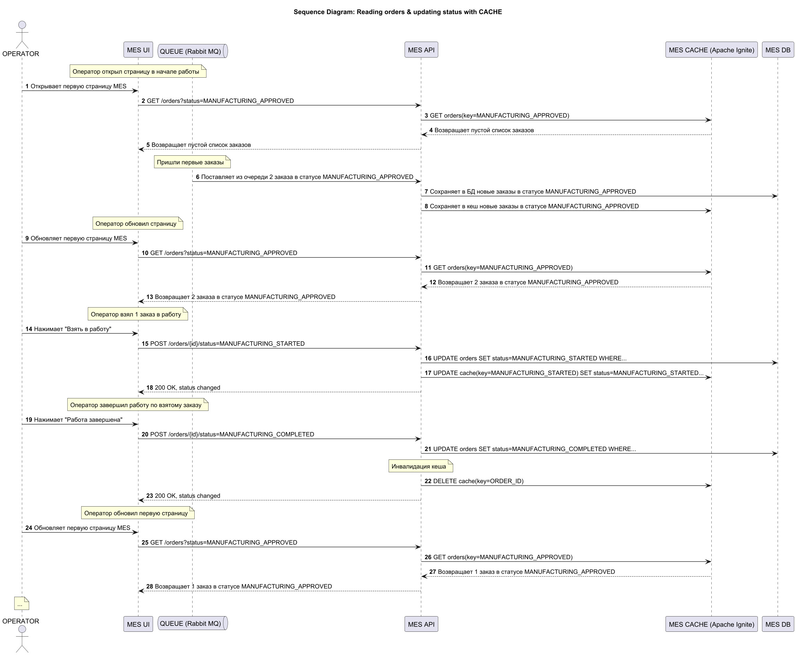

# Задание 5. Кеширование
## Анализ системы компании и C4-диаграммы в контексте планирования кеширования
Операторы недовольны медленной работой первой страницы MES, клиенты — скоростью обработки заказов. Это указывает на недостаточную производительность модуля MES, т.к. клиенты могут быть недовольны скоростью обработки только из-за медленно работающих в MES UI операторов.
Модуль расчета стоимости вроде бы проблем не создает, однако он влияет на общую нагрузку системы, т.к. и расчет, и отдача списка заказов используют одни и те же ресурсы.
В результатах задания 1 предлагалось увеличить количество инстансов для MES API. Можно выделить большую часть из них исключительно под расчет стоимости, оставив оставшиеся под UI Оператора и управление заказами.

Повысить производительность также можно путем внедрения кеширования. 
Поэтому, если увеличение числа инстансов и их сепарация не даст значимого результата, то стоит реализовать кеширование, ускорив тем самым ключевой для Операторов процесс системы — вывод списка новых заказов, подтвержденных Продавцами.
## Мотивация
### Цель
Улучшить скорость работы UI для Операторов. В фокусе - первая страница с самыми новыми заказами (MANUFACTURING_APPROVED, MANUFACTURING_STARTED), т.к.:
* Операторы жалуются на долгую загрузку страницы
* Фильтрация и пагинация не решили проблему
### Какие проблемы решатся
* __Низкая производительность первой страницу MES__ со списком заказов в работе по статусам: недовольство операторов
* __Плохая масштабируемость системы под рост клиентов__ (открытие API для B2B породило недовольство как партнеров-агрегаторов, так и B2C-клиентов).
* __Длительный расчет стоимости__: уменьшение нагрузки на MES API и MES DB может высвободить ресурсы под расчет стоимости и в конечном счёте ускорить её
## Предлагаемое решение
### Тип кеширования
Подходит серверное кеширование, т.к.:
* нагрузка возникает на бэкенде MES API или и базе данных MES DB
* важно получать актуальные данные как можно быстрее, т.е. клиентское кеширование с указанием возрастом кеша не лучший вариант, т.к. он будет минимальный
* нагрузка связана с получением новых заказов, т.е. еще нет идентификаторов сущностей для удобного клиентского кеширования
### Паттерны
Предлагается выбрать паттерн Write-Through, т.к.:
* задержка передачи данных при записи в БД не имеет значения, т.к.:
  * новые заказы MANUFACTURING_APPROVED приходят из RabbitMQ, т.е. асинхронно. В случае ошибки записи легко переповторить
  * время на изменение Оператором статуса заказа в MANUFACTURING_STARTED незначительно в сравнении с первичным получение списка заказов, на который жалуется операторы
* данные между кешем и БД будут всегда синхронизированны, а значит оператор будет видеть актуальную информацию и из-за неконсистентности данных шансы "потери" заказа, на которую много жалоб, сводятся к нулю
* изменения становятся доступными в кеше почти сразу после вычитки из очереди
* другие паттерны не совсем подходят:
  * Cache-Aside: несогласованность данных в кеше с БД, низкая скорость обновления данных и сложность реализации, т.к. речь про новые заказы, идентификаторы которых отсутствуют в кеше и не связаны с оператором - возврат заказов из кеша по кэш-попаданию не подходит
  * Read-Through: речь про новые заказы, идентификаторы которых отсутствуют в кеше и не связаны с оператором - возврат заказов из кеша по кэш-попаданию не подходит
  * Refresh-ahead: речь про новые заказы, идентификаторы которых отсутствуют в кеше и не связаны с оператором - возврат заказов из кеша по кэш-попаданию не подходит
  * Write-Behind: дополнительная асинхронность записи в БД с одной стороны плюс, но с другой - не оправдывает себя, т.к. привносит риск неконсистеных данных в БД и дальнейшей потери заказа, на которую жалуются клиенты
### Инструменты
Предлагается выбрать Apache Ignite, более удобный чем Redis для работы за рамками обычного доступа "ключ-значение", т.к. работа с кешем предполагается в виде обмена списками заказов, для их отображения на Первой странице MES с фильтрацией по статусу,
### Диаграмма последовательности
[Диаграмма последовательности работы с кэшом](jewerly_sequence_cache.jpg)

### Стратегия инвалидации кэша
Предлагается программная инвалидация, т.к. заказы в MES DB обновляется только из MES API (один источник изменений) и инвалидация заказов в кеше (удаление записей) происходит только при завершении заказа.
Инвалидация заказов осуществляется по ключу, т.к. известен конкретный заказ и нет смысла перечитывать весь массив данных заказов в статусе XXX из БД

* Временная инвалидация: __не подходит__, т.к. устаревание кеша определяется конкретным событием (завершение заказа), до наступления которого кеш остается актуальным источником данных
* Инвалидация, основанная на запросах: __не подходит__, т.к. при выбранном паттерне Write-Through данные кеша и БД для статусов MANUFACTURING_APPROVED и MANUFACTURING_STARTED всегда синхронизированы, а для последующих статусов инвалидация бесмысленна - таких заказов не должно быть в кеше
* Инвалидация, основанная на изменениях: __не подходит__, т.к. при выбранном паттерне Write-Through изменения данных заказов выполняются сервисом напрямую в кеше и нет необходимости в их инвалидации
* Инвалидация по ключу: по сути в контексте паттерна Write-Through в MES API инвалидация по ключу при завершении заказа __синонимична__ программной инвалидации

